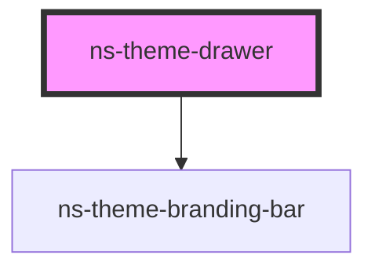

# ns-theme-drawer

<!-- Auto Generated Below -->

## Properties

| Property     | Attribute     | Description | Type      | Default     |
| ------------ | ------------- | ----------- | --------- | ----------- |
| `headerText` | `header-text` |             | `string`  | `undefined` |
| `isFixed`    | `is-fixed`    |             | `boolean` | `undefined` |
| `isOpened`   | `is-opened`   |             | `boolean` | `undefined` |
| `items`      | --            |             | `[]`      | `[]`        |
| `position`   | `position`    |             | `string`  | `'left'`    |

## CSS Custom Properties

| Name                                 | Description                    |
| ------------------------------------ | ------------------------------ |
| `--ns-theme-drawer-background-color` | Color of the drawer background |
| `--ns-theme-drawer-border-color`     | Color of the drawer border     |
| `--ns-theme-drawer-width`            | Width of the drawer            |

## Dependencies

### Depends on

- [ns-theme-branding-bar](../ns-theme-branding-bar)

### Graph

----------------------------------------------

*Built with [StencilJS](https://stenciljs.com/)*
