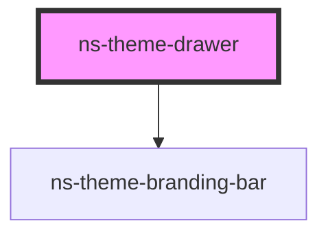

# ns-theme-drawer

<!-- Auto Generated Below -->

## Properties

| Property     | Attribute     | Description                           | Type      | Default     |
| ------------ | ------------- | ------------------------------------- | --------- | ----------- |
| `headerText` | `header-text` | The header text for the drawer.       | `string`  | `undefined` |
| `isFixed`    | `is-fixed`    | Make the drawer be in fixed position. | `boolean` | `undefined` |
| `isOpened`   | `is-opened`   | The open state of the drawer.         | `boolean` | `undefined` |
| `items`      | --            | The navigation list items.            | `[]`      | `[]`        |
| `position`   | `position`    | The position of the drawer.           | `string`  | `'left'`    |

## CSS Custom Properties

| Name                                 | Description                    |
| ------------------------------------ | ------------------------------ |
| `--ns-theme-drawer-background-color` | Color of the drawer background |
| `--ns-theme-drawer-border-color`     | Color of the drawer border     |
| `--ns-theme-drawer-width`            | Width of the drawer            |

## Dependencies

### Depends on

- [ns-theme-branding-bar](../ns-theme-branding-bar)

### Graph

----------------------------------------------

*Build with Love by JS!*
