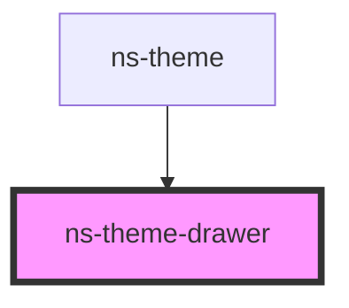

# ns-theme-drawer

<!-- Auto Generated Below -->

## Properties

| Property           | Attribute            | Description                            | Type      | Default       |
| ------------------ | -------------------- | -------------------------------------- | --------- | ------------- |
| `anchor`           | `anchor`             | The anchor position of the drawer.     | `string`  | `'left'`      |
| `headerActionText` | `header-action-text` | The header action text for the drawer. | `string`  | `'Close All'` |
| `headerText`       | `header-text`        | The header text for the drawer.        | `string`  | `undefined`   |
| `isFixed`          | `is-fixed`           | Make the drawer be in fixed position.  | `boolean` | `undefined`   |
| `isOpened`         | `is-opened`          | The open state of the drawer.          | `boolean` | `undefined`   |
| `items`            | --                   | The navigation list items.             | `[]`      | `[]`          |

## Methods

### `toggle() => Promise<void>`

#### Returns

Type: `Promise<void>`

## CSS Custom Properties

| Name                                 | Description                    |
| ------------------------------------ | ------------------------------ |
| `--ns-theme-drawer-background-color` | Color of the drawer background |
| `--ns-theme-drawer-border-color`     | Color of the drawer border     |
| `--ns-theme-drawer-width`            | Width of the drawer            |

## Dependencies

### Used by

 - [ns-theme](../ns-theme)

### Graph

----------------------------------------------

*Build with Love by JS!*
