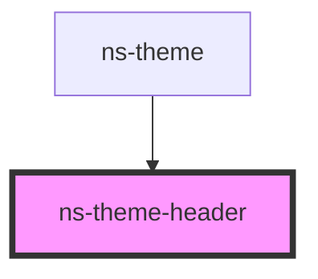

# ns-theme-header

<!-- Auto Generated Below -->

## Properties

| Property     | Attribute     | Description                      | Type        | Default     |
| ------------ | ------------- | -------------------------------- | ----------- | ----------- |
| `headerText` | `header-text` | The title for the header         | `string`    | `undefined` |
| `isFixed`    | `is-fixed`    | Header in fixed position or not  | `boolean`   | `undefined` |
| `items`      | --            | Main navigation items            | `NavItem[]` | `undefined` |
| `profile`    | --            | Profile navigation items         | `NavItem[]` | `undefined` |
| `settings`   | --            | Settings navigation items        | `NavItem[]` | `undefined` |
| `showHome`   | `show-home`   | Show Home menu button            | `boolean`   | `undefined` |
| `showMenu`   | `show-menu`   | Show Toggle menu button          | `boolean`   | `undefined` |
| `tabCount`   | `tab-count`   | The tabCount for the tab manager | `number`    | `undefined` |
| `user`       | --            | User properties for user menu    | `IUser`     | `undefined` |

## Events

| Event             | Description                                            | Type               |
| ----------------- | ------------------------------------------------------ | ------------------ |
| `menuToggleClick` | menuToggleClick dispatches when menu button is pressed | `CustomEvent<any>` |
| `tabManagerClick` |                                                        | `CustomEvent<any>` |

## CSS Custom Properties

| Name                                        | Description                                   |
| ------------------------------------------- | --------------------------------------------- |
| `--px-app-nav-background-color`             | Color of the nav item background              |
| `--px-app-nav-box-shadow`                   | Color of the nav box shadow                   |
| `--px-app-nav-item-background-color--hover` | Color of the nav item background when hovered |
| `--px-app-nav-item-text-color`              | Color of the nav item text                    |
| `--px-app-nav-item-text-color--hover`       | Color of the nav item text when hovered       |

## Dependencies

### Used by

 - [ns-theme](../ns-theme)

### Graph

----------------------------------------------

*Build with Love by JS!*
