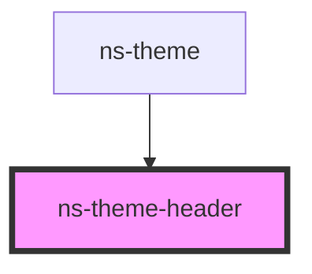

# ns-theme-header

<!-- Auto Generated Below -->

## Properties

| Property     | Attribute     | Description                     | Type        | Default                                      |
| ------------ | ------------- | ------------------------------- | ----------- | -------------------------------------------- |
| `headerText` | `header-text` | The title for the header        | `string`    | `undefined`                                  |
| `isFixed`    | `is-fixed`    | Header in fixed position or not | `boolean`   | `undefined`                                  |
| `items`      | --            | Main navigation items           | `NavItem[]` | `[]`                                         |
| `profile`    | --            | Profile navigation items        | `[]`        | `[]`                                         |
| `settings`   | --            | Settings navigation items       | `[]`        | `[]`                                         |
| `showHome`   | `show-home`   | Show Home button                | `boolean`   | `undefined`                                  |
| `showMenu`   | `show-menu`   | Show Menu button                | `boolean`   | `undefined`                                  |
| `user`       | --            | User properties for user menu   | `object`    | `{ name: null, picture: null, email: null }` |

## Events

| Event          | Description | Type                   |
| -------------- | ----------- | ---------------------- |
| `navItemClick` |             | `CustomEvent<NavItem>` |

## CSS Custom Properties

| Name                                        | Description                                   |
| ------------------------------------------- | --------------------------------------------- |
| `--px-app-nav-background-color`             | Color of the nav item background              |
| `--px-app-nav-box-shadow`                   | Color of the nav box shadow                   |
| `--px-app-nav-item-background-color--hover` | Color of the nav item background when hovered |
| `--px-app-nav-item-text-color`              | Color of the nav item text                    |
| `--px-app-nav-item-text-color--hover`       | Color of the nav item text when hovered       |

## Dependencies

### Used by

 - [ns-theme](../ns-theme)

### Graph

----------------------------------------------

*Build with Love by JS!*
