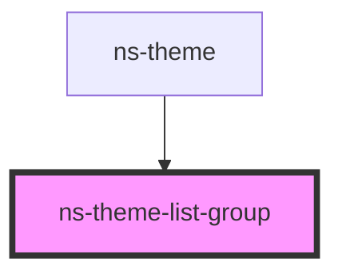

# ns-theme-list-group

<!-- Auto Generated Below -->

## Properties

| Property | Attribute | Description | Type        | Default     |
| -------- | --------- | ----------- | ----------- | ----------- |
| `items`  | --        |             | `TabItem[]` | `undefined` |

## Events

| Event      | Description | Type                   |
| ---------- | ----------- | ---------------------- |
| `tabClick` |             | `CustomEvent<TabItem>` |

## Dependencies

### Used by

 - [ns-theme](../ns-theme)

### Graph

----------------------------------------------

*Build with Love by JS!*
