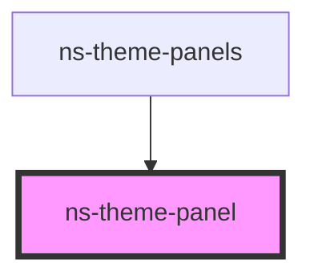

# ns-theme-panel

<!-- Auto Generated Below -->

## Properties

| Property   | Attribute  | Description | Type      | Default |
| ---------- | ---------- | ----------- | --------- | ------- |
| `loading`  | `loading`  |             | `boolean` | `false` |
| `selected` | `selected` |             | `boolean` | `false` |

## Dependencies

### Used by

 - [ns-theme-panels](../ns-theme-panels)

### Graph

----------------------------------------------

*Build with Love by JS!*
