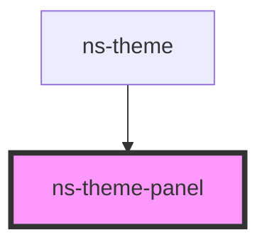

# ns-theme-panel

<!-- Auto Generated Below -->

## Properties

| Property   | Attribute  | Description | Type      | Default     |
| ---------- | ---------- | ----------- | --------- | ----------- |
| `selected` | `selected` |             | `boolean` | `undefined` |

## Dependencies

### Used by

 - [ns-theme](../ns-theme)

### Graph

----------------------------------------------

*Build with Love by JS!*
