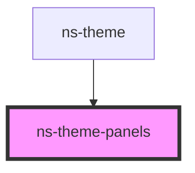

# ns-theme-panels

<!-- Auto Generated Below -->

## Properties

| Property        | Attribute        | Description | Type     | Default     |
| --------------- | ---------------- | ----------- | -------- | ----------- |
| `selectedIndex` | `selected-index` |             | `number` | `undefined` |

## Methods

### `closePanel(item: any) => Promise<void>`

#### Returns

Type: `Promise<void>`

### `togglePanel(item: any) => Promise<void>`

#### Returns

Type: `Promise<void>`

## Dependencies

### Used by

 - [ns-theme](../ns-theme)

### Graph

----------------------------------------------

*Build with Love by JS!*
