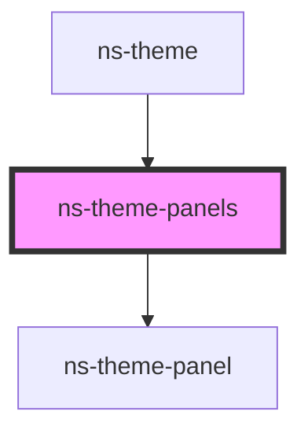

# ns-theme-panels

<!-- Auto Generated Below -->

## Properties

| Property        | Attribute        | Description | Type     | Default     |
| --------------- | ---------------- | ----------- | -------- | ----------- |
| `selectedIndex` | `selected-index` |             | `number` | `undefined` |

## Methods

### `addPanel(tab: TabItem, element: any) => Promise<HTMLNsThemePanelElement>`

#### Returns

Type: `Promise<HTMLNsThemePanelElement>`

### `closePanel(tab: TabItem) => Promise<void>`

#### Returns

Type: `Promise<void>`

### `getActivePanel() => Promise<void>`

#### Returns

Type: `Promise<void>`

### `getPanelNodes() => Promise<NodeListOf<HTMLNsThemePanelElement>>`

#### Returns

Type: `Promise<NodeListOf<HTMLNsThemePanelElement>>`

### `getPanels() => Promise<any[]>`

#### Returns

Type: `Promise<any[]>`

### `togglePanel(tab: TabItem) => Promise<void>`

#### Returns

Type: `Promise<void>`

## Dependencies

### Used by

 - [ns-theme](../ns-theme)

### Depends on

- [ns-theme-panel](../ns-theme-panel)

### Graph

----------------------------------------------

*Build with Love by JS!*
