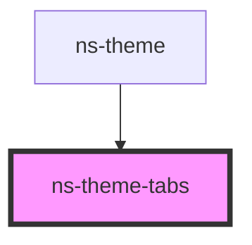

# ns-theme-tabs

<!-- Auto Generated Below -->

## Properties

| Property        | Attribute        | Description                | Type        | Default     |
| --------------- | ---------------- | -------------------------- | ----------- | ----------- |
| `homeTab`       | --               |                            | `TabItem`   | `undefined` |
| `items`         | --               |                            | `TabItem[]` | `[]`        |
| `selectedIndex` | `selected-index` | The default selected index | `number`    | `0`         |

## Events

| Event       | Description | Type                     |
| ----------- | ----------- | ------------------------ |
| `tabAdded`  |             | `CustomEvent<TabItem>`   |
| `tabChange` |             | `CustomEvent<TabItem[]>` |
| `tabClick`  |             | `CustomEvent<TabItem>`   |
| `tabClose`  |             | `CustomEvent<TabItem>`   |

## Methods

### `addTab(tab: TabItem) => Promise<{ id: string; selected?: boolean; href: string; label: string; title?: string; panelId?: string; index?: number; home?: boolean; }>`

Add a tab to the tabs

#### Returns

Type: `Promise<{ id: string; selected?: boolean; href: string; label: string; title?: string; panelId?: string; index?: number; home?: boolean; }>`

### `closeTab(tab: TabItem) => Promise<TabItem>`

Close a tab from the tab set.

#### Returns

Type: `Promise<TabItem>`

### `getTabs() => Promise<TabsMap>`

Get the current tabs rendered

#### Returns

Type: `Promise<TabsMap>`

### `selectHomeTab() => Promise<any>`

Select home tab finds the home tab from the tabs.

#### Returns

Type: `Promise<any>`

### `toggleTab(tab: TabItem) => Promise<void>`

Handles toggling a tab's selected property.

#### Returns

Type: `Promise<void>`

## Dependencies

### Used by

 - [ns-theme](../ns-theme)

### Graph

----------------------------------------------

*Build with Love by JS!*
