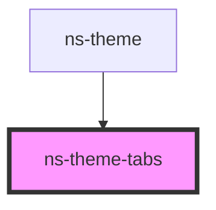

# ns-theme-tabs

<!-- Auto Generated Below -->

## Properties

| Property   | Attribute  | Description                | Type        | Default |
| ---------- | ---------- | -------------------------- | ----------- | ------- |
| `items`    | --         | The default tabs to render | `TabItem[]` | `[]`    |
| `selected` | `selected` | The default selected index | `number`    | `0`     |

## Events

| Event       | Description | Type                     |
| ----------- | ----------- | ------------------------ |
| `tabAdded`  |             | `CustomEvent<TabItem>`   |
| `tabChange` |             | `CustomEvent<TabItem[]>` |
| `tabClick`  |             | `CustomEvent<TabItem>`   |
| `tabClose`  |             | `CustomEvent<any>`       |

## Methods

### `addTab(item: TabItem) => Promise<TabItem[]>`

Add a tab to the tabs

#### Returns

Type: `Promise<TabItem[]>`

### `closeTab(index: any) => Promise<this>`

Close a tab from the tab set.

#### Returns

Type: `Promise<this>`

### `getTabs() => Promise<TabItem[]>`

Get the current tabs rendered

#### Returns

Type: `Promise<TabItem[]>`

## Dependencies

### Used by

 - [ns-theme](../ns-theme)

### Graph

----------------------------------------------

*Build with Love by JS!*
