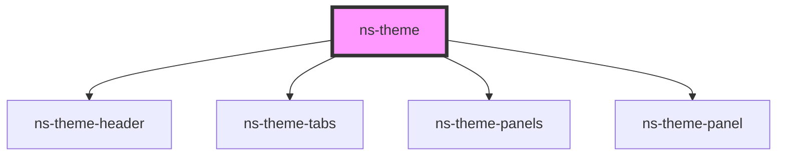

# ns-theme


<!-- Auto Generated Below -->


## Usage

### Index

## usage for ns-theme

This is how you use this element.

```html
//Add tag here

//Add props
```


## Properties

| Property | Attribute | Description | Type        | Default |
| -------- | --------- | ----------- | ----------- | ------- |
| `tabs`   | --        |             | `NavItem[]` | `[]`    |


## Methods

### `addTab(tab: any) => Promise<void>`


#### Returns

Type: `Promise<void>`


### `closeTab(index: any) => Promise<void>`


#### Returns

Type: `Promise<void>`


### `open() => Promise<boolean>`


#### Returns

Type: `Promise<boolean>`


## Dependencies

### Depends on

- [ns-theme-header](../ns-theme-header)
- [ns-theme-tabs](../ns-theme-tabs)
- [ns-theme-panels](../ns-theme-panels)
- [ns-theme-panel](../ns-theme-panel)

### Graph


----------------------------------------------

*Build with Love by JS!*
