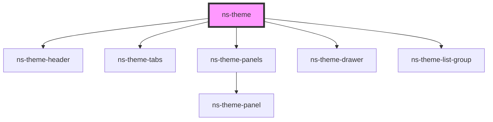

# ns-theme


<!-- Auto Generated Below -->


## Usage

### Index

## usage for ns-theme

This is how you use this element.

```html
//Add tag here

//Add props
```


## Properties

| Property  | Attribute | Description | Type        | Default     |
| --------- | --------- | ----------- | ----------- | ----------- |
| `session` | --        |             | `Session`   | `undefined` |
| `tabs`    | --        |             | `TabItem[]` | `[]`        |


## Methods

### `addTab(tab: any, el: any) => Promise<{ newTab: TabItem; newPanel: HTMLNsThemePanelElement; }>`


#### Returns

Type: `Promise<{ newTab: TabItem; newPanel: HTMLNsThemePanelElement; }>`


### `createPane(t: any) => Promise<HTMLDivElement>`


#### Returns

Type: `Promise<HTMLDivElement>`


### `getNsPanels() => Promise<HTMLNsThemePanelsElement>`


#### Returns

Type: `Promise<HTMLNsThemePanelsElement>`


### `getNsTabs() => Promise<HTMLNsThemeTabsElement>`


#### Returns

Type: `Promise<HTMLNsThemeTabsElement>`


### `open() => Promise<boolean>`


#### Returns

Type: `Promise<boolean>`


### `selectHomeTab() => Promise<TabItem>`


#### Returns

Type: `Promise<TabItem>`


## Dependencies

### Depends on

- [ns-theme-header](../ns-theme-header)
- [ns-theme-tabs](../ns-theme-tabs)
- [ns-theme-panels](../ns-theme-panels)
- [ns-theme-drawer](../ns-theme-drawer)
- [ns-theme-list-group](../ns-theme-list-group)

### Graph


----------------------------------------------

*Build with Love by JS!*
